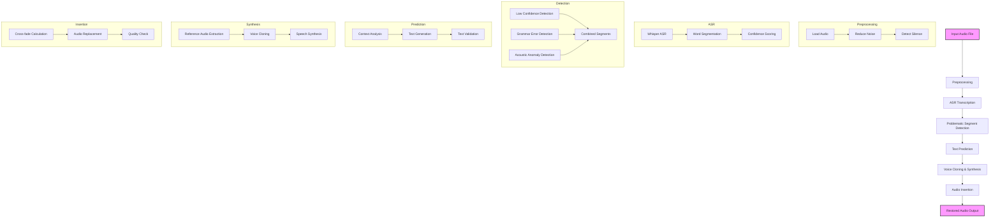

# Speech Restoration Program

A Python-based program for restoring problematic speech segments in audio files using advanced machine learning techniques.

## Features

- Automatic Speech Recognition (ASR) using Whisper
- Problematic segment detection using multiple methods:
  - Low ASR confidence
  - Grammar errors
  - Acoustic anomalies
- Text prediction using language models
- Voice cloning and speech synthesis using Coqui TTS
- Seamless audio insertion with cross-fading

## Requirements

- Python 3.8+
- CUDA-capable GPU (recommended for faster processing)
- See `requirements.txt` for Python dependencies

## Installation

1. Clone the repository:
```bash
git clone <repository-url>
cd speech-restoration
```

2. Create and activate a virtual environment:
```bash
python -m venv venv
source venv/bin/activate  # On Windows: .\venv\Scripts\activate
```

3. Install dependencies:
```bash
pip install -r requirements.txt
```

## Usage

Basic usage:
```bash
python src/main.py path/to/input/audio.wav
```

Advanced options:
```bash
python src/main.py path/to/input/audio.wav --language english --output_dir output
```

### Arguments

- `input_path`: Path to the input audio file (required)
- `--language`: Language of the audio (default: "english")
- `--output_dir`: Directory to save output files (default: "output")

## Project Structure

```
speech-restoration/
├── src/
│   ├── preprocessing.py    # Audio loading and preprocessing
│   ├── asr.py             # Automatic Speech Recognition
│   ├── detection.py       # Problematic segment detection
│   ├── prediction.py      # Text prediction
│   ├── tts.py            # Voice cloning and synthesis
│   └── main.py           # Main program
├── requirements.txt       # Python dependencies
└── README.md             # This file
```

## How It Works

1. **Preprocessing**: Load and clean the input audio
2. **ASR**: Transcribe the audio and get word-level timestamps
3. **Detection**: Identify problematic segments using multiple methods
4. **Prediction**: Generate replacement text for problematic segments
5. **Synthesis**: Clone the speaker's voice and synthesize new speech
6. **Insertion**: Seamlessly insert the new speech with cross-fading

## Detailed Flow Chart



### Step Details

#### 1. Preprocessing
- **Input**: Audio file (.wav)
- **Tasks**:
  - Load audio file
  - Reduce background noise
  - Detect and handle silence segments
- **Output**: Cleaned audio data and sample rate

#### 2. ASR Transcription
- **Input**: Cleaned audio data
- **Tasks**:
  - Transcribe audio using Whisper
  - Generate word-level timestamps
  - Calculate confidence scores
- **Output**: 
  - Full transcription text
  - Word segments with timestamps
  - Confidence scores per segment

#### 3. Problematic Segment Detection
- **Input**: ASR results
- **Tasks**:
  - Detect low confidence segments
  - Identify grammar errors
  - Find acoustic anomalies
  - Combine and sort problematic segments
- **Output**: List of problematic segments with timestamps

#### 4. Text Prediction
- **Input**: Problematic segments and context
- **Tasks**:
  - Analyze surrounding context
  - Generate replacement text
  - Validate predicted text
- **Output**: Predicted text for each problematic segment

#### 5. Voice Cloning & Synthesis
- **Input**: 
  - Reference audio from clean segments
  - Predicted text
- **Tasks**:
  - Extract voice characteristics
  - Clone speaker's voice
  - Synthesize new speech
- **Output**: Synthesized audio segments

#### 6. Audio Insertion
- **Input**: 
  - Original audio
  - Synthesized segments
- **Tasks**:
  - Calculate cross-fade parameters
  - Replace problematic segments
  - Apply cross-fading
  - Quality check
- **Output**: Restored audio file

## Notes

- The program requires a significant amount of computational resources, especially for ASR and TTS
- Processing time depends on the length of the audio and the number of problematic segments
- Results may vary depending on the quality of the input audio and the speaker's voice characteristics

## License

[Your chosen license]

## Acknowledgments

- OpenAI for Whisper
- Hugging Face for Transformers
- Coqui for TTS
- And all other open-source libraries used in this project 